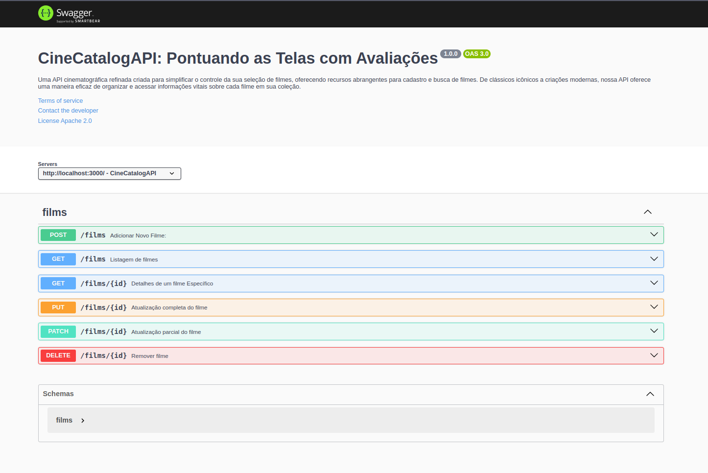

# CineCatalog-API - Documentação

Bem-vindo à documentação da CineCatalog-API, uma API cinematográfica criada para simplificar o gerenciamento de filmes. Neste guia, você encontrará informações sobre como usar a API para cadastrar, consultar e gerenciar filmes em sua coleção.

## Como Usar

Antes de começar, certifique-se de que a API esteja sendo executada localmente. Para isso, siga as instruções abaixo:

1. Clone este repositório para a sua máquina local.
2. Instale as dependências usando o comando `npm install`.
3. Execute a API localmente usando o comando `npm run dev`.
4. Acesse a API em [http://localhost:3000](http://localhost:3000).

Agora você está pronto para explorar as funcionalidades da CineCatalog-API!

## Documentação interativa (Swagger)

O Swagger é uma ferramenta que fornece uma interface interativa para explorar e testar os endpoints da API. Você pode acessar a documentação interativa da ScreenScoreAPI através do Swagger. Siga as instruções abaixo para utilizá-lo:

1. Certifique-se de que a API esteja sendo executada localmente. Caso ainda não tenha feito isso, siga os passos mencionados anteriormente.
2. Abra o seu navegador web.
3. Digite o seguinte endereço na barra de endereços: [http://localhost:3000/api-docs](http://localhost:3000/api-docs).
4. Pressione Enter para acessar a interface interativa do Swagger.

Dentro do Swagger, você terá acesso a uma visão detalhada de todas as rotas, endpoints e parâmetros da API. Você poderá realizar solicitações HTTP diretamente no Swagger para testar as diferentes funcionalidades da ScreenScoreAPI. Isso proporciona uma forma conveniente e segura de explorar e entender como utilizar a API.

Lembre-se de que a API deve estar rodando localmente para que você possa acessar o Swagger e testar os endpoints.

### Cadastro de um Novo Filme

Para cadastrar um novo filme em sua coleção, siga os passos abaixo:

1. Abra o seu aplicativo ou ferramenta de API (por exemplo, Postman).
2. Faça uma solicitação POST para a rota de cadastro de filmes (`http://localhost:3000/api/films`).
3. Preencha os detalhes do filme, como título, diretor, gênero, ano de lançamento e outros atributos relevantes.
4. Envie a solicitação.

### Consulta de Filmes

Para consultar a lista de filmes disponíveis em sua coleção, siga os passos abaixo:

1. Abra o seu aplicativo ou ferramenta de API.
2. Faça uma solicitação GET para a rota de consulta de filmes (`http://localhost:3000/api/films`).
3. Receba uma lista detalhada de todos os filmes na coleção.

### Atualização de Filme

Para atualizar as informações de um filme em sua coleção, siga os passos abaixo:

1. Abra o seu aplicativo ou ferramenta de API.
2. Faça uma solicitação PUT para a rota de atualização de filmes (`http://localhost:3000/api/films/:id`), onde `:id` é o ID do filme que você deseja atualizar.
3. Forneça todos os detalhes do filme que deseja atualizar.
4. Envie a solicitação.

### Exclusão de Filme

Para remover um filme de sua coleção, siga os passos abaixo:

1. Abra o seu aplicativo ou ferramenta de API.
2. Faça uma solicitação DELETE para a rota de exclusão de filmes (`http://localhost:3000/api/films/:id`), onde `:id` é o ID do filme que você deseja excluir.
3. Confirme a ação.
4. O filme será permanentemente excluído da coleção.

## Começando

1. Clone este repositório para a sua máquina local.
2. Instale as dependências usando o comando `npm install`.
3. Execute a API localmente usando o comando `npm start`.
4. Acesse a API em [http://localhost:3000](http://localhost:3000).

## Contribuição

Sinta-se à vontade para contribuir para este projeto abrindo problemas ou enviando pull requests.

## Contato

Se tiver alguma dúvida ou precisar de ajuda, entre em contato conosco em [contato@screenscoreapi.com](mailto:contato@screenscoreapi.com).

---

Certifique-se de que as rotas, endpoints, detalhes e imagens correspondam à sua API e ao seu projeto. Personalize o README de acordo com suas necessidades.
